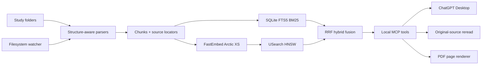

# Study Retriever

Local persistent hybrid retrieval over MCP for ChatGPT Desktop, Codex, and Claude Code. Index study folders once, keep them synchronized, and let the assistant retrieve the relevant notes, papers, slides, code, notebooks, spreadsheets, and documents with exact source locations instead of rescanning whole repositories every chat.

## Retrieval stack

- **Dense semantic search:** FastEmbed 0.8.1 + `snowflake/snowflake-arctic-embed-xs` by default.
- **Lexical search:** SQLite FTS5 BM25.
- **Fusion:** Reciprocal Rank Fusion (RRF).
- **Dense index:** USearch 2.26.2 HNSW, persisted locally.
- **Updates:** size/mtime fast gate, SHA-256 content gate, watchdog filesystem events, background logon watcher.
- **Provenance:** file path plus page, slide, paragraph, table, sheet rows, notebook cell, or line range.
- **Deepening:** exact source reread and PDF-page rendering after retrieval.
- **Integration:** local stdio MCP; no Qdrant server, Typesense server, HTTP daemon, port, or cloud vector database.

Supported content includes PDF, DOCX, PPTX, XLSX/XLSM, IPYNB, HTML, Markdown, Typst (`.typ`), Quarto (`.qmd`), LaTeX, source code, JSON/YAML/XML, CSV, logs, shell/PowerShell, Lean, SVG text labels, NumPy `.npz` metadata, and plain text. Image-only PDF pages and PNG/JPEG/BMP/GIF/TIFF images use Tesseract OCR when it is installed (noisy plot OCR is filtered out). Bare markdown image links are stripped before chunking so converted textbooks are not diluted by them.



The index is a discovery layer. Original files remain authoritative and are never modified by indexing.

## Windows installation

Target: 64-bit Windows 10/11 and ChatGPT Desktop. Internet is needed on the first install for Python packages and the embedding model. Search/indexing are local after those downloads.

Extract the ZIP, open PowerShell in the extracted `study-retriever` folder, and run:

```powershell
.\install.cmd -StudyRoot "D:\Study"
```

Add additional roots after installation with:

```powershell
.\manage.cmd add-root "D:\Books"
.\manage.cmd add-root "C:\Users\me\Notes"
```

No Python setup is required beforehand. The release includes its own prebuilt pure-Python Study Retriever wheel; only the pinned third-party runtime packages and embedding model are downloaded. The installer uses an existing compatible Python 3.11-3.13 when available. Otherwise it installs Python 3.13.16 for the current user; the direct python.org fallback is SHA-256 verified before execution. The runtime itself stays isolated under `%LOCALAPPDATA%\StudyRetriever\runtime\.venv`.

The installer also registers a user-level **Study Retriever Background Indexer** scheduled task by default. It runs the same verified watcher at logon, so new/changed files are indexed even when ChatGPT Desktop is closed. Pass `-NoBackgroundIndexer` to `install.cmd` if you prefer indexing only while ChatGPT is using the plugin.

The installer does not print success until all of these pass on the target machine:

1. package/dependency installation;
2. local neural embedding model download and inference;
3. persisted dense-vector index creation;
4. real dense + lexical retrieval over a temporary document;
5. exact `fetch` verification and cleanup;
6. real watchdog create/modify/delete events;
7. a real MCP stdio subprocess handshake, tool discovery, structured output, indexing, hybrid search, fetch, status, and cleanup;
8. final catalog/vector consistency check.

It then copies the plugin to `~/.codex/plugins/study-retriever` and adds/updates `~/.agents/plugins/marketplace.json` without deleting unrelated marketplace entries. These locations follow the current OpenAI personal-local-marketplace layout.

Restart ChatGPT Desktop, then open a **new Work or Codex chat** so the local plugin tool registry is rebuilt. The personal marketplace marks **Study Retriever** as `INSTALLED_BY_DEFAULT`. If your Desktop build still asks for confirmation, open **Plugins > Personal Local Plugins** and enable it once. Existing chats do not reload changed plugin tools. Other ChatGPT surfaces may expose the skill without attaching the local stdio MCP; use Work or Codex when that happens.


## Claude Code

After the Windows install above, register the same local server with Claude Code (user scope, all projects):

```powershell
claude mcp add --scope user study_retriever -- powershell.exe -NoLogo -NoProfile -NonInteractive -ExecutionPolicy Bypass -File "<path-to>\study-retriever\scripts\mcp-launch.ps1"
```

or install the bundled plugin, which also adds the `study-retrieval` skill:

```powershell
claude plugin marketplace add "<path-to>\study-retriever"
claude plugin install study-retriever@study-retriever --scope user
```

Claude Code connects to MCP servers within 30 seconds by default; set `MCP_TIMEOUT=120000` if the first start is slow while a large sync is running. Claude.ai in the browser cannot use local stdio servers.

## Configuration and security

Settings live in `%LOCALAPPDATA%\StudyRetriever\config.json`. Notable options:

| Option | Default | Purpose |
|---|---|---|
| `reranker_model` | `"Xenova/ms-marco-MiniLM-L-6-v2"` | Cross-encoder rerank of the top hits (80 MB, downloaded on first use; set to `null` to disable and save the model and about 1.2 s per query). On a 39-query hand-labeled sample, reranking the top 10 hits (`rerank_top_k`, text cut to `rerank_chars`=600) raised MRR@10 from 0.51 to 0.65 for about 1.2 s extra per query; the sample is small and biased, so test it on your own material. |
| `exclude_globs` | `[]` | Patterns (relative to the root, e.g. `"*-presentation.pdf"`) that are never indexed. |
| `allow_mcp_root_changes` | `true` | Let an assistant add/remove study roots through MCP tools. Set `false` (or env `STUDY_RETRIEVER_ALLOW_MCP_ROOT_CHANGES=0`) if you index untrusted documents: text inside a document could otherwise steer the assistant into widening what gets indexed. Sensitive folders stay blocked either way. |
| `min_free_disk_mb` | `1024` | The indexer refuses to write when the data drive has less free space; `index_status` reports `free_disk_mb`. |
| `model_idle_unload_seconds` | `300` | Drop the embedding model from RAM after this much idle time (about 180 MB per idle process); `0` disables. |
| `max_text_bytes`, `max_office_uncompressed_bytes`, `max_ocr_pages` | 32 MB, 256 MB, 200 | Fail-closed limits against oversized or crafted files. |

Security model and known limits:

- The server uses stdio only and opens no network port. Indexed text, paths and OCR output are stored unencrypted under the data directory.
- Text returned from search is untrusted document content; the server instructions and the bundled skill tell the model never to follow instructions found in it.
- Drive roots, the whole user profile, credential folders (`.ssh`, `.aws`, ...), system folders and application data are refused as roots. Files that resolve outside their root (for example through a junction) are skipped.
- Not yet covered: the update feed trusts a checksum delivered with the ZIP (no signature), and install-time `pip` resolves transitive dependencies without a hash lock. Verify downloads before installing from an untrusted mirror.
- Embedding-model note: a read-only memory-mapped vector index would save RAM, but Windows refuses to atomically replace a mapped file, so it is deliberately not used.

## Updating an installed release

Study Retriever 1.1+ has an atomic updater. It preserves `%LOCALAPPDATA%\StudyRetriever` (configuration, catalog, vectors, and model cache), replaces only plugin/runtime code, runs the full live health gate, clears only Study Retriever's disposable ChatGPT local-plugin cache, and rolls the previous release back if installation fails.

If you downloaded a newer release ZIP, either extract it and run its updater:

```powershell
.\update.cmd
```

or update directly from the ZIP:

```powershell
.\update.cmd -ReleaseZip "C:\Downloads\Study-Retriever-v1.2.0-Windows.zip"
```

For managed/pushed updates, host `latest.json` beside the release ZIP over HTTPS, then configure the feed once:

```powershell
.\update.cmd -ManifestUrl "https://example.org/study-retriever/latest.json" -SaveFeed -CheckOnly
```

After that, an installed copy can check/install from the saved feed with:

```powershell
.\update.cmd -CheckOnly
.\update.cmd
```

`latest.json` contains the release version, relative/absolute ZIP URL, and SHA-256. Remote updates require HTTPS and the downloaded ZIP must match that SHA-256 before any code executes. The release's bundled wheel has a second SHA-256 in `release.json`. Restart ChatGPT Desktop after a successful update because Desktop executes a cached local-plugin copy.

## Verification after installation

Run this any time:

```powershell
.\verify.cmd
```

`verify.cmd` first validates the exact portable and compatibility plugin manifests that Desktop consumes, then reruns the neural backend, watcher, and real MCP stdio process. A nonzero exit code means the installation should not be treated as healthy.

If `verify.cmd` passes but a new Desktop Work/Codex chat still has no Study Retriever tools, run:

```powershell
.\manage.cmd desktop-doctor
```

This checks the personal marketplace entry, installed source package, ChatGPT cache copy, and user-level plugin/MCP enablement state.

## Local administration

Use `manage.cmd`; no PATH changes are required.

```powershell
.\manage.cmd add-root "D:\Study"
.\manage.cmd sync
.\manage.cmd status
.\manage.cmd search "scaled dot product attention sqrt dk" -k 10
.\manage.cmd topic "encoder decoder attention"
.\manage.cmd benchmark-models
.\manage.cmd set-model BAAI/bge-small-en-v1.5
.\manage.cmd rebuild-vectors
```

`sync` reparses/re-embeds only changed content. By default the installed background indexer keeps configured roots synchronized continuously after Windows logon. The MCP process also has its own watcher, and cross-process locks make duplicate filesystem events harmless.

Run the watcher manually in the foreground for diagnostics:

```powershell
.\manage.cmd watch
```

## ChatGPT retrieval workflow

For “teach me everything about X,” the bundled skill tells ChatGPT to use `curate_topic` first. It receives a bounded cross-source bundle with stable chunk IDs and exact source locations. It then calls `fetch_context`, `read_source`, or `render_pdf_page` only where more detail is needed.

For focused lookup, ChatGPT starts with `search`. This is the path that removes repeated repo-wide exploration.

MCP tools:

- `search`: compact hybrid semantic + BM25 result IDs for normal ChatGPT retrieval.
- `fetch`: exact content and source provenance for one `search` result.
- `search_advanced`: filtered hybrid search with text, scores, dense/lexical ranks, and exact provenance.
- `fetch_context`: exact result plus a configurable number of neighboring chunks.
- `curate_topic`: bounded multi-source teaching/synthesis bundle.
- `read_source`: exact original page/slide/paragraph/table/sheet rows/cell/line range.
- `render_pdf_page`: actual PNG of an indexed PDF page.
- `index_status`: root/source/chunk/vector/model health.
- `sync_index`: incremental reconciliation.
- `add_study_root` / `remove_study_root`: local root management.
- `rebuild_vector_index`: rebuild dense vectors after a model change.

## Local data

Default persistent state:

```text
%LOCALAPPDATA%\StudyRetriever\
  catalog.sqlite3
  vectors-*.usearch
  config.json
  models\
  logs\study-retriever.log
  runtime\.venv\
```

Original study files are not copied into this directory. Removing a root removes its derivative index entries only; it never deletes the original files.

## Embedding model

Default: `snowflake/snowflake-arctic-embed-xs`, 22M parameters and 384 dimensions. It is small enough for local CPU use while giving materially stronger published retrieval quality than MiniLM-class defaults. FastEmbed runs it through ONNX Runtime rather than PyTorch.

The default is intentionally fixed rather than auto-switching models. If machine-specific latency matters, benchmark on the actual machine before changing it:

```powershell
.\manage.cmd benchmark-models
```

## Privacy and network behavior

Corpus parsing, embeddings, BM25, vector search, and file watching run locally. No vector service receives the corpus. When ChatGPT calls the local MCP tool, the selected retrieved text or rendered page is returned into that ChatGPT conversation, so that returned material is processed as conversation/tool content.

First install requires package/model downloads. The normal MCP connection uses standard input/output and does not open a local listening port.

## Uninstall

Remove the plugin registration and installed plugin files while retaining the index/model cache:

```powershell
.\uninstall.cmd
```

Also remove `%LOCALAPPDATA%\StudyRetriever`:

```powershell
.\uninstall.cmd -DeleteIndexAndModels
```

Neither command deletes original study material.

## Developer verification

```powershell
python -m pip install -e ".[dev]"
python -m ruff check src tests scripts
python -m pytest -q
python -m compileall -q src tests scripts
python scripts/build_release.py   # wheel + Windows ZIP; release.json and wheels are generated, not committed
```

Contributing rules: original study files are authoritative and must never be modified or deleted by indexing, tests, or scripts; keep MCP stdout for protocol traffic only (log to the file logger); add a regression test with every fix, using `tmp_path` and a temporary `STUDY_RETRIEVER_HOME`; use Conventional Commit messages. CI runs ruff, a syntax check, and the test suite on Windows and Linux (Python 3.11-3.13) plus a Windows release build.

Report security issues privately through GitHub's "Report a vulnerability". Indexed text and OCR output are stored unencrypted under the local data directory; treat it like the study material it came from.

The dependency-independent suite uses a deterministic feature-hashing retrieval backend to exercise the real catalog, parser, chunker, hybrid ranker, provenance, watcher logic, cross-process locking, and document handling without pretending a neural model exists. It is a functional recovery backend, not a fake test double. The installer/`verify.cmd` separately requires the production FastEmbed + ONNX Runtime + USearch path and actual MCP subprocess to pass on Windows.

